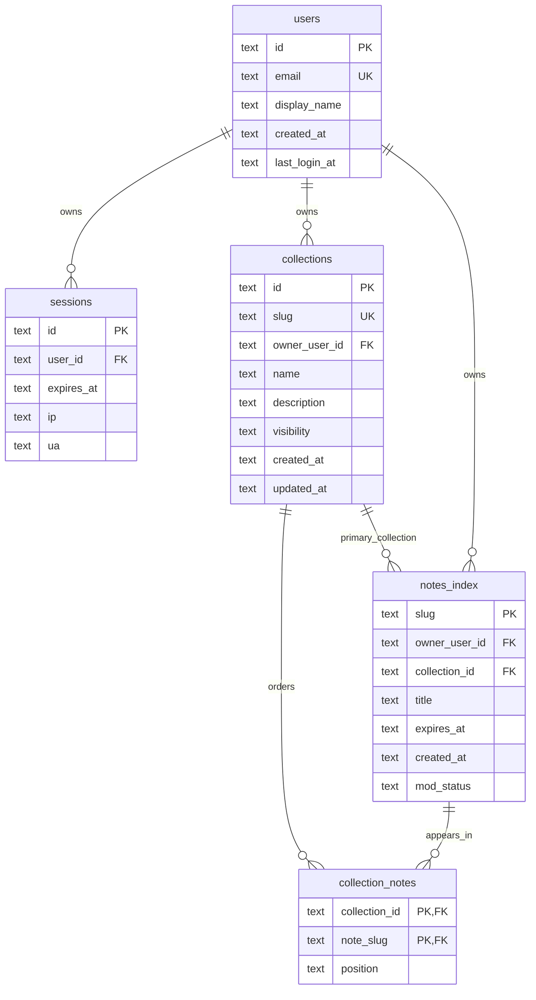

# D1 Data Model

This is the first D1 relational schema for account-backed note organization while keeping the existing KV note body (`n:<slug>`) and metadata (`m:<slug>`) layout as the source of truth for short-lived note content.

## Scope and goals

- Add a normalized D1 index for users, sessions, collections, and note discovery.
- Keep note payloads out of D1; D1 stores ownership, listing, moderation, and collection membership metadata only.
- Keep `notes_index.slug` identical to the public note slug / KV key suffix so existing URLs remain the stable identifier.
- Make the schema compatible with Cloudflare D1 / SQLite and Drizzle schema generation.

## Decisions

### Identifiers

All entity IDs are `TEXT` and are generated by the application. This keeps D1 portable and avoids coupling to SQLite autoincrement IDs when Workers code already creates opaque tokens and slugs.

`notes_index.slug` is the primary key and maps directly to KV:

- content key: `n:<slug>`
- metadata key: `m:<slug>`
- relational row: `notes_index.slug = <slug>`

### Time fields

Temporal columns are stored as UTC ISO-8601 `TEXT` values. `created_at` and `updated_at` default to SQLite `CURRENT_TIMESTAMP`; `expires_at` mirrors the KV expiration window where present.

D1 does not have a native timestamp type, so text timestamps keep SQL ordering predictable for ISO strings and align with the existing Worker metadata headers.

### Ownership and deletion

- Deleting a user cascades their sessions and collections.
- User deletion sets `notes_index.owner_user_id` to `NULL` instead of deleting the note index row, because public/unlisted notes may still need moderation/audit visibility until KV expiry or explicit deletion.
- Deleting a collection cascades `collection_notes` rows and sets `notes_index.collection_id` to `NULL`.
- Deleting a note index row cascades its collection membership rows.

### Collections and collection membership

`collections.visibility` supports:

- `public`: discoverable collection page.
- `unlisted`: accessible by slug but not listed publicly.
- `private`: owner-only.

`notes_index.collection_id` is a nullable primary/default collection pointer for simple list queries and backward-compatible single-collection flows. `collection_notes` is the ordered membership table; it allows a note to be placed in one or more collections and keeps per-collection order through `position`.

`collection_notes.position` is `TEXT` instead of `INTEGER` to allow future fractional / lexicographic ranking without rewriting the table.

### Moderation

`notes_index.mod_status` supports:

- `active`: visible under normal visibility rules.
- `pending`: created/imported but awaiting moderation or review.
- `blocked`: hidden due to abuse, Safe Browsing, Workers AI moderation, or admin action.
- `deleted`: tombstoned for audit/list consistency after explicit deletion.

The existing abuse and admin KV flags can be reconciled into this field when M3/M4 flows wire D1 writes.

## ER diagram



## Tables

### `users`

| Column | Type | Null | Notes |
|---|---:|---:|---|
| `id` | `TEXT` | no | Application-generated user ID. |
| `email` | `TEXT` | no | Unique login identity. |
| `display_name` | `TEXT` | yes | Optional UI name. |
| `created_at` | `TEXT` | no | Defaults to `CURRENT_TIMESTAMP`. |
| `last_login_at` | `TEXT` | yes | Updated after successful login. |

Indexes:

- `users_email_unique` unique on `email`.

### `sessions`

| Column | Type | Null | Notes |
|---|---:|---:|---|
| `id` | `TEXT` | no | Session token ID / opaque session ID. |
| `user_id` | `TEXT` | no | FK to `users.id`, cascade delete. |
| `expires_at` | `TEXT` | no | Session expiry timestamp. |
| `ip` | `TEXT` | yes | Last/client IP for audit and abuse triage. |
| `ua` | `TEXT` | yes | User-Agent for audit and device display. |

Indexes:

- `sessions_user_id_idx` on `user_id`.
- `sessions_expires_at_idx` on `expires_at`.

### `collections`

| Column | Type | Null | Notes |
|---|---:|---:|---|
| `id` | `TEXT` | no | Application-generated collection ID. |
| `slug` | `TEXT` | no | Public stable collection slug, unique. |
| `owner_user_id` | `TEXT` | no | FK to `users.id`, cascade delete. |
| `name` | `TEXT` | no | Display name. |
| `description` | `TEXT` | yes | Optional collection summary. |
| `visibility` | `TEXT` | no | `public`, `unlisted`, or `private`; defaults to `private`. |
| `created_at` | `TEXT` | no | Defaults to `CURRENT_TIMESTAMP`. |
| `updated_at` | `TEXT` | no | Defaults to `CURRENT_TIMESTAMP`; app updates on edits. |

Indexes / constraints:

- `collections_slug_unique` unique on `slug`.
- `collections_owner_user_id_idx` on `owner_user_id`.
- `collections_visibility_idx` on `visibility`.
- `collections_visibility_check` limits visibility values.

### `notes_index`

| Column | Type | Null | Notes |
|---|---:|---:|---|
| `slug` | `TEXT` | no | Primary key; same slug used by `n:<slug>` and `m:<slug>` KV keys. |
| `owner_user_id` | `TEXT` | yes | FK to `users.id`, set null on user delete. |
| `collection_id` | `TEXT` | yes | Nullable primary/default collection FK, set null on collection delete. |
| `title` | `TEXT` | no | Search/list title; app can derive from note content if absent. |
| `expires_at` | `TEXT` | yes | Mirrors KV expiry when the note is temporary; null for non-expiring indexed rows if supported later. |
| `created_at` | `TEXT` | no | Defaults to `CURRENT_TIMESTAMP`. |
| `mod_status` | `TEXT` | no | `active`, `pending`, `blocked`, or `deleted`; defaults to `active`. |

Indexes / constraints:

- `notes_index_owner_user_id_idx` on `owner_user_id`.
- `notes_index_collection_id_idx` on `collection_id`.
- `notes_index_expires_at_idx` on `expires_at`.
- `notes_index_mod_status_idx` on `mod_status`.
- `notes_index_mod_status_check` limits moderation values.

### `collection_notes`

| Column | Type | Null | Notes |
|---|---:|---:|---|
| `collection_id` | `TEXT` | no | FK to `collections.id`, cascade delete. |
| `note_slug` | `TEXT` | no | FK to `notes_index.slug`, cascade delete. |
| `position` | `TEXT` | no | Lexicographic sort key within the collection. |

Indexes / constraints:

- Composite primary key `collection_notes_pk` on `(collection_id, note_slug)`.
- `collection_notes_note_slug_idx` on `note_slug`.
- `collection_notes_collection_position_idx` on `(collection_id, position)`.

## Equivalent SQL

The Drizzle schema in `src/schema.ts` should generate SQL equivalent to this D1 / SQLite shape:

```sql
CREATE TABLE `users` (
  `id` text PRIMARY KEY NOT NULL,
  `email` text NOT NULL,
  `display_name` text,
  `created_at` text DEFAULT CURRENT_TIMESTAMP NOT NULL,
  `last_login_at` text
);
CREATE UNIQUE INDEX `users_email_unique` ON `users` (`email`);

CREATE TABLE `sessions` (
  `id` text PRIMARY KEY NOT NULL,
  `user_id` text NOT NULL,
  `expires_at` text NOT NULL,
  `ip` text,
  `ua` text,
  FOREIGN KEY (`user_id`) REFERENCES `users`(`id`) ON UPDATE cascade ON DELETE cascade
);
CREATE INDEX `sessions_user_id_idx` ON `sessions` (`user_id`);
CREATE INDEX `sessions_expires_at_idx` ON `sessions` (`expires_at`);

CREATE TABLE `collections` (
  `id` text PRIMARY KEY NOT NULL,
  `slug` text NOT NULL,
  `owner_user_id` text NOT NULL,
  `name` text NOT NULL,
  `description` text,
  `visibility` text DEFAULT 'private' NOT NULL,
  `created_at` text DEFAULT CURRENT_TIMESTAMP NOT NULL,
  `updated_at` text DEFAULT CURRENT_TIMESTAMP NOT NULL,
  FOREIGN KEY (`owner_user_id`) REFERENCES `users`(`id`) ON UPDATE cascade ON DELETE cascade,
  CONSTRAINT `collections_visibility_check` CHECK (`visibility` in ('public', 'unlisted', 'private'))
);
CREATE UNIQUE INDEX `collections_slug_unique` ON `collections` (`slug`);
CREATE INDEX `collections_owner_user_id_idx` ON `collections` (`owner_user_id`);
CREATE INDEX `collections_visibility_idx` ON `collections` (`visibility`);

CREATE TABLE `notes_index` (
  `slug` text PRIMARY KEY NOT NULL,
  `owner_user_id` text,
  `collection_id` text,
  `title` text NOT NULL,
  `expires_at` text,
  `created_at` text DEFAULT CURRENT_TIMESTAMP NOT NULL,
  `mod_status` text DEFAULT 'active' NOT NULL,
  FOREIGN KEY (`owner_user_id`) REFERENCES `users`(`id`) ON UPDATE cascade ON DELETE set null,
  FOREIGN KEY (`collection_id`) REFERENCES `collections`(`id`) ON UPDATE cascade ON DELETE set null,
  CONSTRAINT `notes_index_mod_status_check` CHECK (`mod_status` in ('active', 'pending', 'blocked', 'deleted'))
);
CREATE INDEX `notes_index_owner_user_id_idx` ON `notes_index` (`owner_user_id`);
CREATE INDEX `notes_index_collection_id_idx` ON `notes_index` (`collection_id`);
CREATE INDEX `notes_index_expires_at_idx` ON `notes_index` (`expires_at`);
CREATE INDEX `notes_index_mod_status_idx` ON `notes_index` (`mod_status`);

CREATE TABLE `collection_notes` (
  `collection_id` text NOT NULL,
  `note_slug` text NOT NULL,
  `position` text NOT NULL,
  FOREIGN KEY (`collection_id`) REFERENCES `collections`(`id`) ON UPDATE cascade ON DELETE cascade,
  FOREIGN KEY (`note_slug`) REFERENCES `notes_index`(`slug`) ON UPDATE cascade ON DELETE cascade,
  CONSTRAINT `collection_notes_pk` PRIMARY KEY (`collection_id`, `note_slug`)
);
CREATE INDEX `collection_notes_note_slug_idx` ON `collection_notes` (`note_slug`);
CREATE INDEX `collection_notes_collection_position_idx` ON `collection_notes` (`collection_id`, `position`);
```

## M3 / M4 alignment notes

- Auth/session work can use `users.email`, `users.last_login_at`, and `sessions.expires_at` directly without adding extra tables.
- Collection browsing/editing work has stable `collections.slug`, `visibility`, and `collection_notes.position` fields for public/unlisted/private pages and ordered note lists.
- Note listing/search work can query `notes_index` by owner, collection, expiry, and moderation state while loading note bodies from KV by `slug`.
- Moderation/admin work can treat `mod_status = 'blocked'` as the D1 mirror of current abuse/admin disable behavior.
